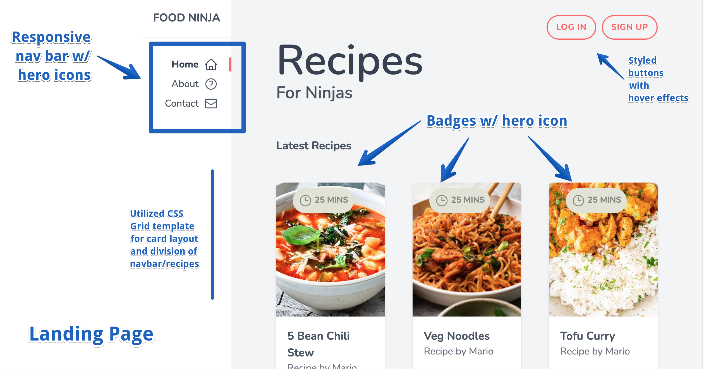
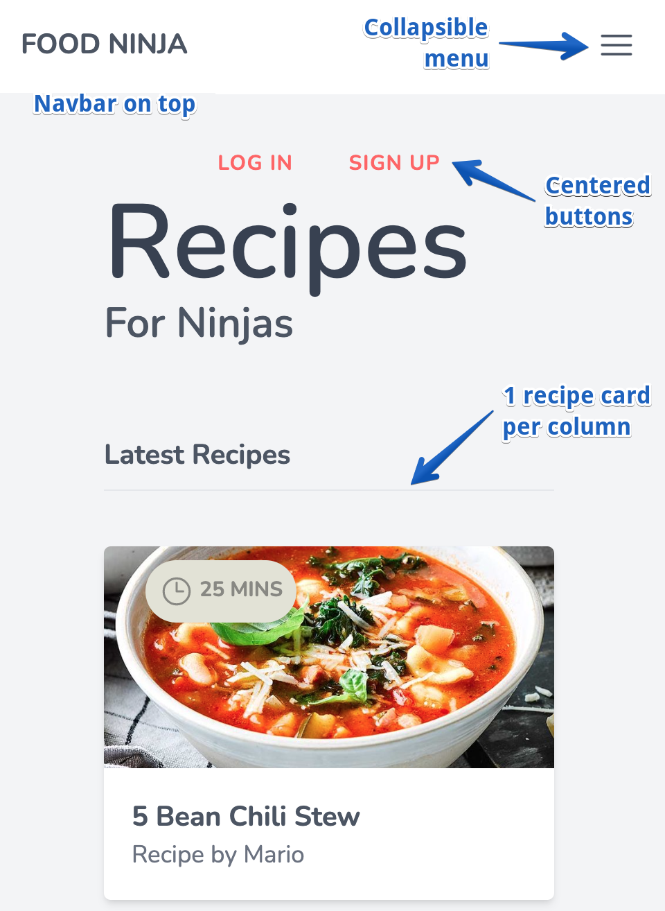

# Food Ninja

## Deployed Link
[Name](LinkGoesHere.com)

## Description
Static landing page styled with tailwind.css

## Table of Contents
- [Installation](#Installation)  
- [Usage](#Usage)
- [Resources](#resources)
- [License](#License)
- [Contributing](#contributing)
- [Questions](#Questions)

## Installation
- [tailwindcss](https://tailwindcss.com/)

## Usage
Step 1 description

Step 2 description

## Resources 
- [heroicons](https://heroicons.com/)

NOTE: The deployed link is a single static page with hover effects. All buttons/links are disabled.

## License
MIT

## Contributing
[Sara Baqla](https://github.com/missatrox44) 

[The Net Ninja](https://netninja.dev/)

## Questions
Github username: [missatrox44](https://github.com/missatrox44)  
Email: missatrox44@gmail.com